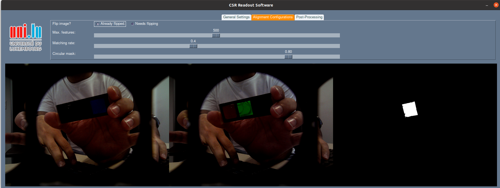

# CSR-FM Detector



This repository contains the tool to detect CSR-based Fiducial Markers (FMs) in a custom stereo-vision camera. It requires a set of configurations to ensure perfect image alignment applied to the images taken by the camera. The main goal is to keep only the frame differences (i.e., CSRs) and remove other matched sections. In this regard, the frames acquired by one of the cameras are horizontally flipped. Then keypoints and descriptors are extracted using the [Oriented FAST and Rotated BRIEF (ORB)](https://docs.opencv.org/4.x/d1/d89/tutorial_py_orb.html "Oriented FAST and Rotated BRIEF (ORB)") algorithm. A [homography matrix](https://docs.opencv.org/4.x/d1/de0/tutorial_py_feature_homography.html "homography matrix") is found using the matching data, and the registered version of the input image is created to match the other image perfectly. The following step is to apply some post-processing functions to ensure the output contains only the unmatched section of the frames.

### 🚀 Libraries

You will need below libraries to be installed before running the application:

- numpy >= 1.17.4
- opencv_python >= 4.1
- PySimpleGUI >= 4.59.0
- typing_extensions >= 4.2.0

You can also run the command below in the root directory to get all of them installed:

```python
pip install -r requirements.txt
```

### ℹ️ Versions

- Version 0.3 (June 2022):
    - Added ArUco Marker generator to UI
    - More utils in the GUI
- Version 0.2 (May 2022):
    - Added GUI for simpler configuration
    - Added both-side subtraction to cover all differences
    - Added camera setting configuration
    - Added ArUco marker detector
- Version 0.1 (January 2022):
    - A simple image difference detector
    - An image alignment module
    - A post-processing module
    - An obstacle filtration module

### 📝 TODOs

- Read camera outputs from ROS
- Add a ArUco tag detector/interpereter
- Enhanse the image alignment using rs-align (https://github.com/IntelRealSense/librealsense/tree/master/examples/align)
    - Consider adding the RGB output to the IR output for a better depth understanding
- Add ROS wrapper for Realsense (https://github.com/IntelRealSense/realsense-ros)